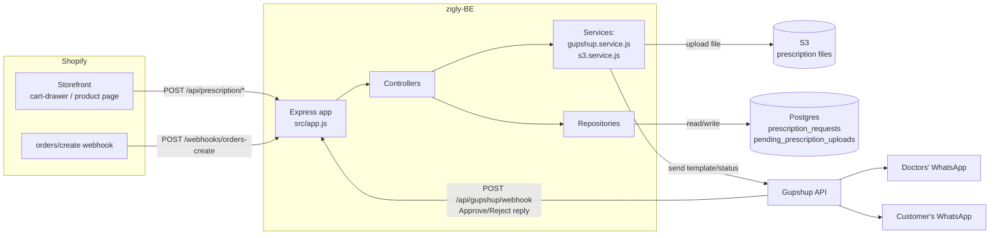

# Backend Architecture & Services

Overview of what this backend (`zigly-BE`) does, how requests flow through it,
and what each service/repository is responsible for. For deep dives on
specific parts of the system, see:
- [prescription-whatsapp-architecture.md](prescription-whatsapp-architecture.md) — the doctor Approve/Reject race-condition flow in detail.
- [unicommerce-prescription-hold.md](unicommerce-prescription-hold.md) — the open investigation into holding Rx orders at Shopify before they reach Unicommerce.

## 1. What this backend does

Zigly sells prescription (Rx) medicines on Shopify. Before an Rx order can be
fulfilled, a doctor must approve the prescription. This backend is the glue
between the Shopify storefront/order and that approval, conducted entirely
over WhatsApp via the Gupshup Conversation Cloud API:

1. A prescription request (file upload, or a "consult later" request) is
   created — either directly from the storefront, or automatically when a
   Shopify order containing an Rx product is placed.
2. The same WhatsApp template, with Approve/Reject buttons, is sent to every
   configured doctor number (primary, and optionally secondary/tertiary) at
   the same time.
3. Whichever doctor taps first wins; the customer gets a status update, and
   any other doctor gets told the request was already handled so they don't
   act on a stale one.

## 2. High-level architecture

## 3. Deployment targets

The same Express app (`src/app.js`) runs behind two different entry points —
neither knows or cares which one is in front of it:

- **`src/server.js`** — plain `app.listen()`, used when running as a
  long-lived Node process (e.g. on Railway). Validates required env vars via
  `validateConfig()` and exits early if any are missing, so misconfiguration
  fails fast at boot rather than surfacing as a runtime error later.
- **`src/lambda.js`** — wraps the app with `serverless-http` for AWS
  Lambda + API Gateway. Strips the API Gateway stage name and a fixed
  `/zigly-prescription-upload` route prefix off the incoming path before
  handing off to Express, since Express's routes are defined relative to the
  app root (e.g. `/health`, not `/default/zigly-prescription-upload/health`).

Both webhook handlers (Gupshup, Shopify) assume the request finishes
processing *before* the HTTP response is sent — there is no fire-and-forget
background work queued after an early ack. This matters specifically for the
Lambda entry point, which freezes the execution environment the moment the
response promise resolves, silently killing anything still in flight.

## 4. Request flow — routes and webhooks

| Method + path | Handler | Purpose |
| --- | --- | --- |
| `GET /health` | `app.js` | Liveness check, returns `{ success: true, status: 'ok' }`. |
| `POST /api/prescription/upload` | `prescription.controller.js#uploadPrescription` | Customer uploads a prescription file directly (multipart). |
| `POST /api/prescription/consult` | `#requestConsultation` | Customer requests a doctor consult with no file attached. |
| `POST /api/prescription/status` | `#getPrescriptionStatus` | Storefront polls approval status for a set of product ids by phone. |
| `POST /api/prescription/auto-consult` | `#autoConsultFromOrder` | Fires from the storefront right after checkout (headless ORDER_PLACED event) when no file was staged. |
| `POST /api/prescription/auto-upload` | `#autoUploadFromOrder` | Same as above, but with a file the customer picked in the cart drawer pre-checkout. |
| `POST /api/prescription/stage-upload` | `#stagePrescriptionUpload` | Uploads a file to S3 *before* checkout and returns a key, which the cart drawer attaches to the cart as an attribute. |
| `POST /webhooks/orders-create` | `shopifyWebhook.controller.js#handleOrderCreate` | Shopify's `orders/create` webhook — the reliable, server-side path that doesn't depend on the customer's browser surviving checkout. |
| `POST /api/gupshup/webhook` | `gupshupWebhook.controller.js#handleWebhook` | Gupshup's callback when a doctor taps Approve/Reject. |

`auto-consult`/`auto-upload` and the `orders/create` webhook both notify on
the same order — each checks `existsByShopifyOrderId` first and skips if the
other path already handled it, so the doctor/customer never gets duplicate
messages.

## 5. Services

- **`src/services/gupshup.service.js`** — all outbound Gupshup Conversation
  Cloud API calls: sending the Approve/Reject template to one or many doctor
  numbers (`sendTemplateMessageToDoctors`), sending the raw prescription file
  as a follow-up media message, and sending the Approve/Reject status update
  back to the customer/other doctors. Backup-doctor sends are best-effort —
  a failure there is logged and swallowed rather than failing the whole
  request, since the primary send already carries the request.
- **`src/services/s3.service.js`** — uploads a prescription file buffer to
  S3 and returns its public HTTPS URL, which Gupshup needs to fetch the file
  as a template header image or media message. No explicit AWS credentials;
  relies on the Lambda execution role (or local AWS config outside Lambda).
- **`src/db/pool.js`** — a shared `pg` connection pool (max 3 connections),
  built from `config.db.*`, used by both repositories below.

## 6. Repositories (data access)

- **`src/repositories/prescriptionRequest.repository.js`** — CRUD-ish access
  to the `prescription_requests` table: create a request, update its status
  by whichever doctor's Gupshup `messageId` replied (guarded by
  `status = 'pending'` so the first reply wins), look up recent requests by
  phone for the `/status` endpoint, and check for an existing Shopify order
  id to avoid duplicate notifications.
- **`src/repositories/pendingPrescriptionUpload.repository.js`** — a small
  key → S3-URL table bridging the pre-checkout staged upload (`/stage-upload`)
  to the `orders/create` webhook, which has no other way to know a file was
  uploaded. Creates its own table on first use (`CREATE TABLE IF NOT EXISTS`)
  rather than going through a migration runner, since there isn't one in this
  project. Consumed (deleted) on read so a key can't be replayed across
  orders.

## 7. Data model

See [db/schema.sql](../db/schema.sql) for the authoritative definition.

- **`prescription_requests`** — one row per prescription request, whichever
  path created it. Tracks the primary/secondary/tertiary Gupshup message ids
  (join keys for the Approve/Reject webhook), customer name/phone, method
  (`consult` or `upload`), the S3 file URL (if any), the cart's product list
  as JSONB, status (`pending` / `approved` / `rejected`), and the Shopify
  order id once one exists.
- **`pending_prescription_uploads`** — ephemeral key → file-URL rows, deleted
  as soon as the `orders/create` webhook consumes them.

## 8. Configuration

All required/optional environment variables are documented inline in
[.env.example](../.env.example) — Gupshup credentials and doctor numbers,
S3 bucket/region, Postgres connection, and `SHOPIFY_WEBHOOK_SECRET` for
verifying the `orders/create` webhook's HMAC signature. `src/config/env.js`
loads them into a single `config` object; `validateConfig()` (called from
`server.js` at boot) hard-fails startup if any Gupshup-related variable is
missing.

## 9. Testing

`tests/` has a Jest + Supertest suite covering the controllers, the Gupshup
service, and both repositories — see [tests/](../tests/). Every external
dependency (Gupshup HTTP calls, S3, Postgres, the Shopify HMAC secret) is
mocked, so `npm test` runs with no real network or database access.
