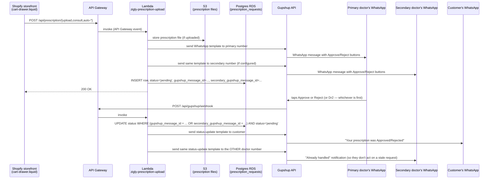

# Prescription → WhatsApp Architecture

## 1. How a prescription request reaches both doctors on WhatsApp

Two ways a request gets created:
- **Client-initiated**: the cart-drawer calls `/upload`, `/consult`, `/auto-consult`, or `/auto-upload` directly.
- **Server-initiated (reliable path)**: Shopify's `orders/create` webhook → `shopifyWebhook.controller.js` — this is the one that actually matters for fulfillment-blocking, since it doesn't depend on the customer's browser surviving checkout.

## 2. Both doctors, first reply wins

Both the primary and secondary doctor numbers get the same WhatsApp template at the same time (`gupshupService.sendTemplateMessageToDoctors` in `src/services/gupshup.service.js`), each carrying its own Approve/Reject buttons tied to its own Gupshup `messageId` (`gupshup_message_id` / `secondary_gupshup_message_id` on the `prescription_requests` row).

Whichever doctor taps first, the webhook handler's `UPDATE ... WHERE status = 'pending'` guard (`updateStatusByMessageId` in `src/repositories/prescriptionRequest.repository.js`) makes that reply win — a later tap from the other doctor's number matches zero rows (status is no longer `pending`), so it's a no-op rather than overwriting the decision. `gupshupWebhook.controller.js` logs that case at `info` level (distinct from a truly unrecognized message id, which stays a `warn`) so it's easy to tell "expected race, second doctor was just slower" apart from "something's actually wrong" in the logs.

## 3. Notifying the doctor who didn't respond

When one doctor's reply updates the row, two notifications go out from `gupshupWebhook.controller.js`:
1. **Customer** — the existing `GUPSHUP_STATUS_TEMPLATE_ID` template, to `customer_phone`.
2. **The other doctor** — the *same* status template, sent to whichever of `GUPSHUP_SEND_TO` / `GUPSHUP_SEND_TO_SECONDARY` did *not* match the incoming reply's message id. This reuses the customer-facing template rather than a dedicated one, so the copy reads like a customer status line rather than "your colleague already handled this" — acceptable for now, worth revisiting with a purpose-written Gupshup template if it reads confusingly to doctors in practice.

If `GUPSHUP_SEND_TO_SECONDARY` isn't configured, only the primary doctor is notified and there's nothing to cross-notify — same behavior as before this feature existed.

## 4. Why there's no EventBridge job anymore

An earlier version of this feature sent the request to the primary doctor only, and used an EventBridge-scheduled polling job (`escalatePendingPrescriptions.js`) to resend to the secondary number after a 2-minute timeout if the primary hadn't responded. Since both doctors now get the request up front, there's no "unresponded after N minutes" case left to detect — that job, its Lambda/EventBridge wiring, and the `PRESCRIPTION_ESCALATION_MINUTES` config have all been removed. No scheduled infra is needed for this feature at all anymore.
